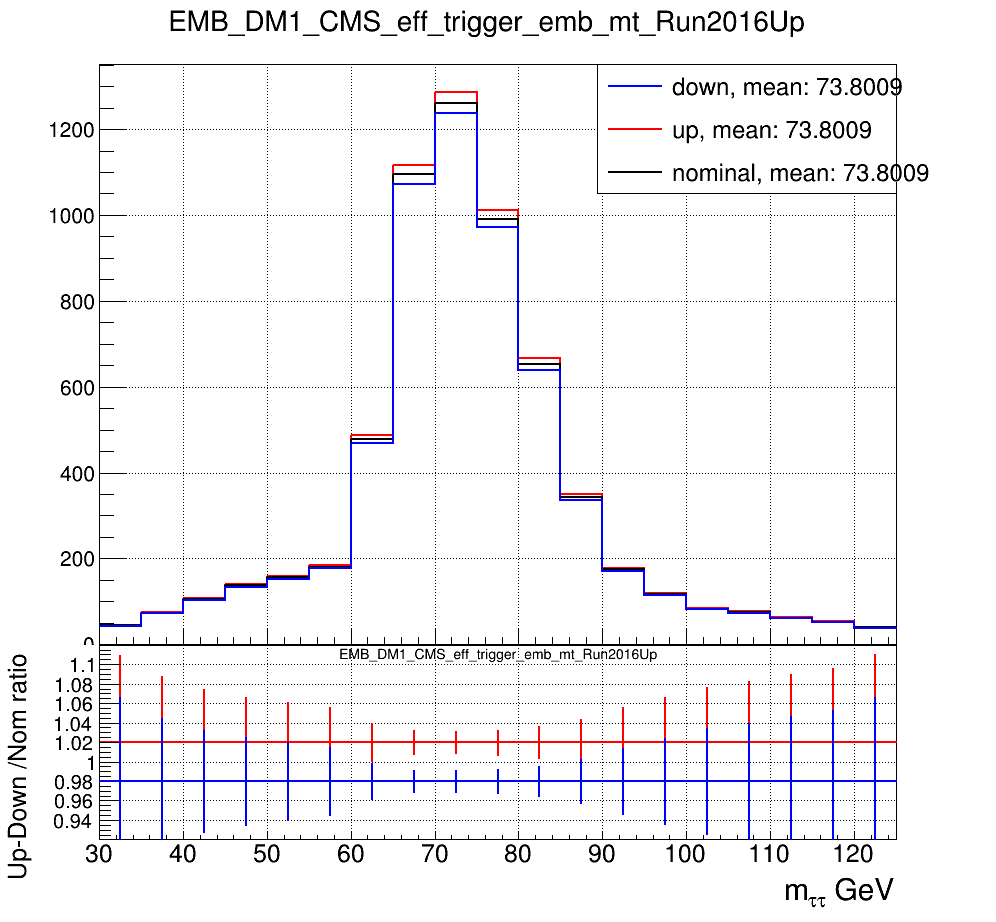

# up_down_shape_variation
A script to see up and down variation 

This piece of code plots the nominal shapes and its up/down variations. 
You can do it for different categories $p_{T}$ and DM-wise 

It includes the following processes: `EMB`, `TTJ`, `TTL`, `TTT`, `VVJ`, `VVL`, `VVT`, `W`, `ZJ`, `ZL`, `ZTT`

Before the execution activate cvmfs for `centos7`:

```
source /cvmfs/sft.cern.ch/lcg/views/LCG_100/x86_64-centos7-gcc10-opt/setup.sh
```

And specity input file and output folder in `input_output.json` config file. 
Input file should is a file produce after SYNC step   [here](https://github.com/conformist89/smhtt_ul/blob/master/embeddded_tauID_ul2018.sh#L147)

Usage of the script is quite simple:

```
python3 shifter.py
```

As the result, you will get the following histogram for every $p_{T}$ and DM in the output folder:

